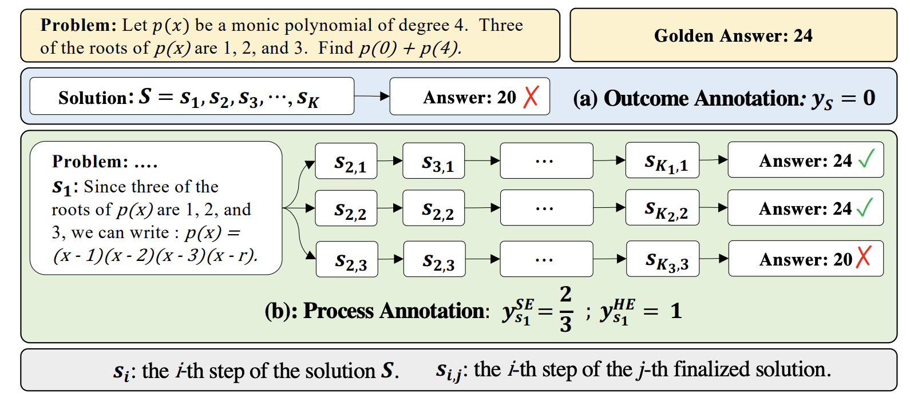
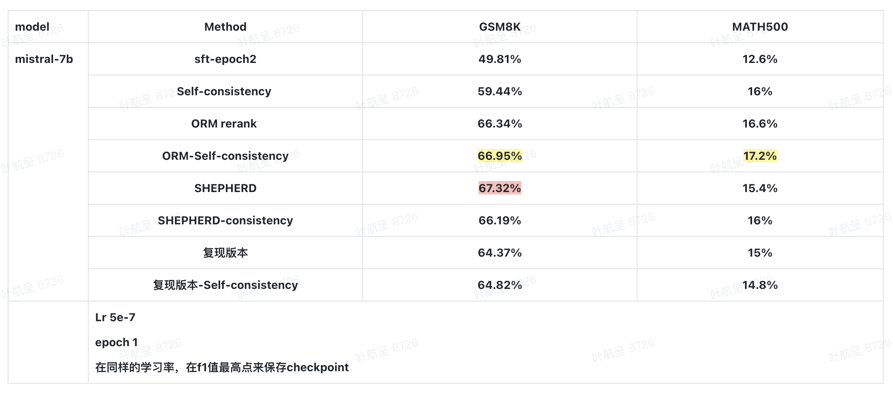
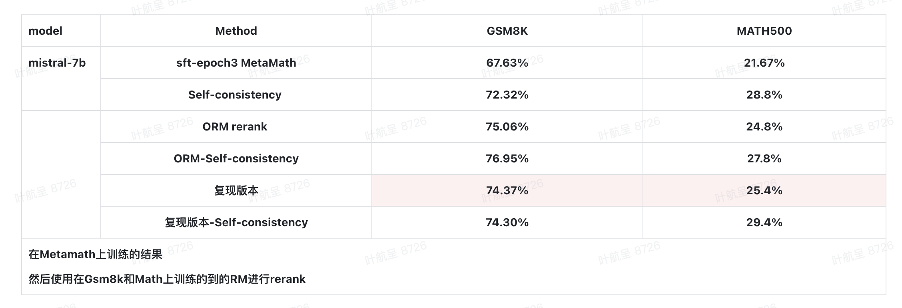
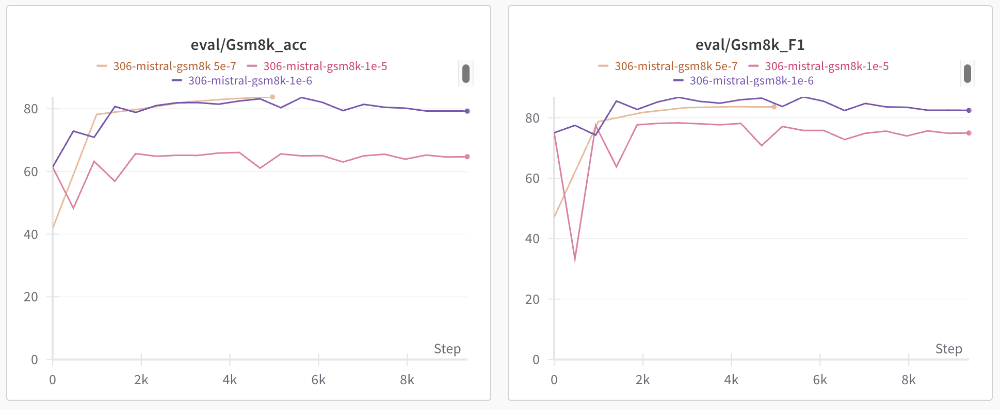
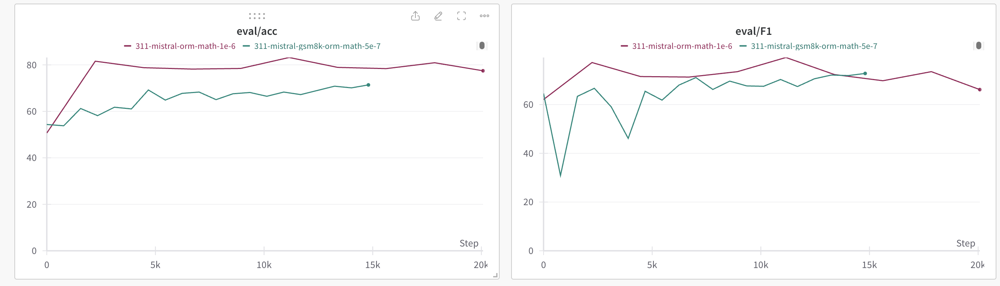
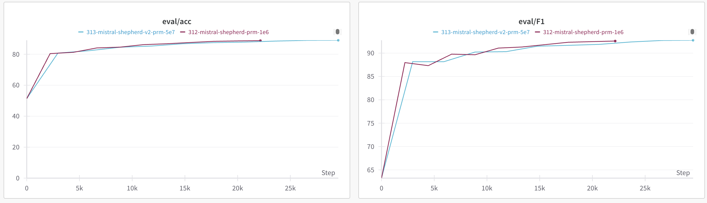

# Shepherd
<div align="center">
    
<p>Generated by <a href="https://openai.com/dall-e-3">DALL·E 3</a></p>
</div>

# 介绍
<p align="center"></p>

<p align="center">
<div style="width: 550px; margin: auto; text-indent: 2em;">
PRM 数据自动标注，通过在每个步骤继续往下生成多个结果来判断该步骤是否正确，例如在一个步骤基础上继续生成3个结果，如果其中生成的结果中有正确的，则认为这个步骤是正确的，否则将这个步骤标注为错误。
目前实现的是Gsm8k和Math数据集。
</div>
</p>

## 运行SFT

```shell
bash ./Shepherd/SFT/scripts/run_sft.sh
```
- 将Gsm8K和Math数据集中的/n和/n/n换成\<step\>方便Vllm在此处暂停

## 运行PRM数据生成

```shell
bash ./Shepherd/scripts/vllm_shepherd.sh
```

## 运行ORM

```shell
bash ./Shepherd/scripts/run_orm_train.sh
bash ./Shepherd/scripts/run_orm_infer.sh
```
- 在Gsm8k或者Math上训练一个epoch，之后在Gsm8k和Math上每个prompt生成15个response，并且通过规则匹配的方式对所有的respons打上0、1标签。得到上述数据集后再进行RM的训练。

## 运行PRM

```shell
bash ./Shepherd/scripts/run_prm_train.sh
bash ./Shepherd/scripts/run_prm_infer.sh
```
- 同样是在Gsm8K或者Math上训练一个epoch。推理的时候每个prompt生成到\<step\>标志时会继续往下生成3个结果，通过规则匹配判断这三个结果中是否有正确的结果，如有正确的结果，则将改\<step\>标注为1，反之标注为0.

## 实验结果汇总
### MATH和Gsm8上rerank实验结果
<p align="center"></p>

- 在Gsm8k和Math上进行rerank的实验结果

### MetaMath上rerank实验结果
<p align="center"></p>

- 在MetaMath上进行rerank的实验结果

当前的实验结果还没有超过ORM，但是使用论文中提供的数据集进行训练小幅超过了ORM，可以改进的地方有：

1. 增加rollout的数量，目前是3，提高数量的话对这个步骤是否能得到正确的答案估计会更加准确
2. 增加prompt对应response的数量，这个方法可能增益不会太明显，因为当前已经使用了足够多的数据量。
3. 将最后一个正确步骤前面的所有步骤标注为1，这样比较的话与人工标注方法会更加一致。
4. 优化生成方法，将生成的方法建成树，通过遍历和回溯来给所有step标注，这样标注的效率会高很多
5. 参考Core的方法进行蒙特卡罗树搜索，训练token level和solution level的rm对所有的推理路径进行打分，最后通过卡阈值对所有的step进行标注。
6. 添加api实现

个人认为这种方法应该是比不过GPT-4进行步骤标注的acc，但是目前复现还不完善，暂时没有进行对比。

ORM和PRM都是在Gsm8k和Math数据集上得到的（不是MetaMath上生成的结果）

## learning curve
<p align="center">
</p>

<div align="center">
<p>Gsm8k-orm Learning curve</a></p>

<p align="center">
</p>
<p>Math-orm Learning curve</a></p>

<p align="center">
</p>
<p>Gsm8k-prm Learning curve</a></p>

</div>

## 参考文献
- [math-shepherd](https://arxiv.org/abs/2312.08935)

- [verifier](https://arxiv.org/abs/2110.14168)

- [Let’s Verify Step by Step](https://arxiv.org/pdf/2305.20050.pdf)


